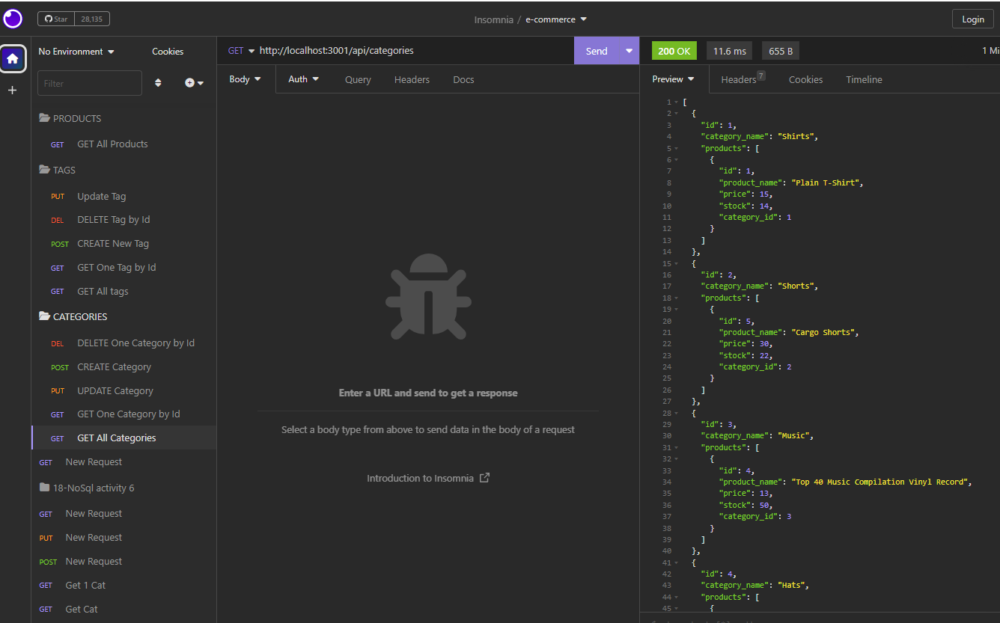

# E-commerce-Back-End-site-Object-Relational-Mapping-
## Description

The back-end database has been purposed towards e-commerce websites using Express.js API and Sequelize to connect to the MySQL database. The back-end database allows users to create a development database, seed it with test data, and sync Sequelize models to MySQL database. User's have the ability to use GET, POST, PUT, and DELETE routes to display and manipulate data in the users database. Give it a try and see how it helps your company power up to the next level!

## Table of Contents:
- [Overview](#Overview)
- [Installation Process](#Installation-Process)
- [Built With](#Built-With)
- [What I Learned](#What-I-Learned)
- [Continued Development](#Continued-Development)
- [License](#License)

## GIF:
### Figure .1 GIF

The following animation demonstrates the application functionality:

The link to video:  https://drive.google.com/file/d/15pj4h3YqXrmust2Omzt-CebQZOQ3rt7T/view
## GitHub Repository:
[GitHub Repository:](https://github.com/WajhR/E-commerce-Back-End-site-Object-Relational-Mapping-)

## Screenshots:
### GET-All-categories route Screenshot
 

## Installation Process
1. Clone the Repository from GitHub (or) Download Zip Folder from Repository from GitHub.
2. Open the cloned (or downloaded) repository in any source code editor.
3. Open the integrated terminal of the document and complete the respective installation guides provided in "Built With" to ensure the cloned documentation will operate.

## Built With

- JSON:[ JSON](https://www.npmjs.com/package/json)
- Dynamic JavaScript
- Dotenv: [8.6.0](https://www.npmjs.com/package/dotenv)
- Express: [4.17.1](https://www.npmjs.com/package/express)
- Node.js: [Version 16.18.1](https://nodejs.org/en/blog/release/v16.18.1/)
- Express.js:[Express.js](https://expressjs.com/en/starter/installing.html)
- Node MySql2: [2.3.3](https://www.npmjs.com/package/mysql2)
- Sequelize: [6.29.3](https://www.npmjs.com/package/sequelize)
- Insomnia: [by Kong](https://insomnia.rest/)
- Nodemon: [2.0.12](https://www.npmjs.com/package/nodemon/v/2.0.12)

## What I Learned:
1. How to use Express.js to create a functional back end for an e-commerce website.
2. How to connect to a MySQL database using Sequelize and update environment variable files accordingly.
3. How to generate a development database with test data using schema and seed commands.

## License
  
 [Open Source Initiative Link](https://opensource.org/licenses/MIT)
